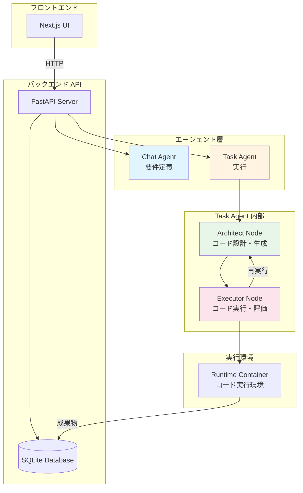
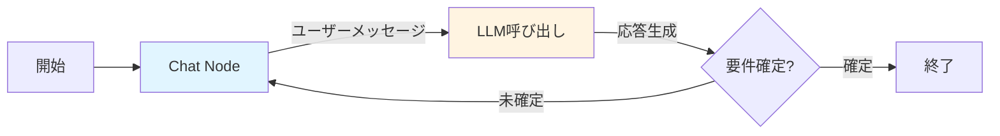
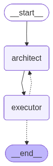
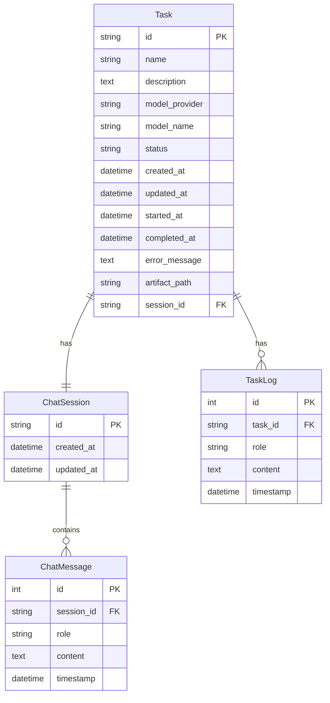
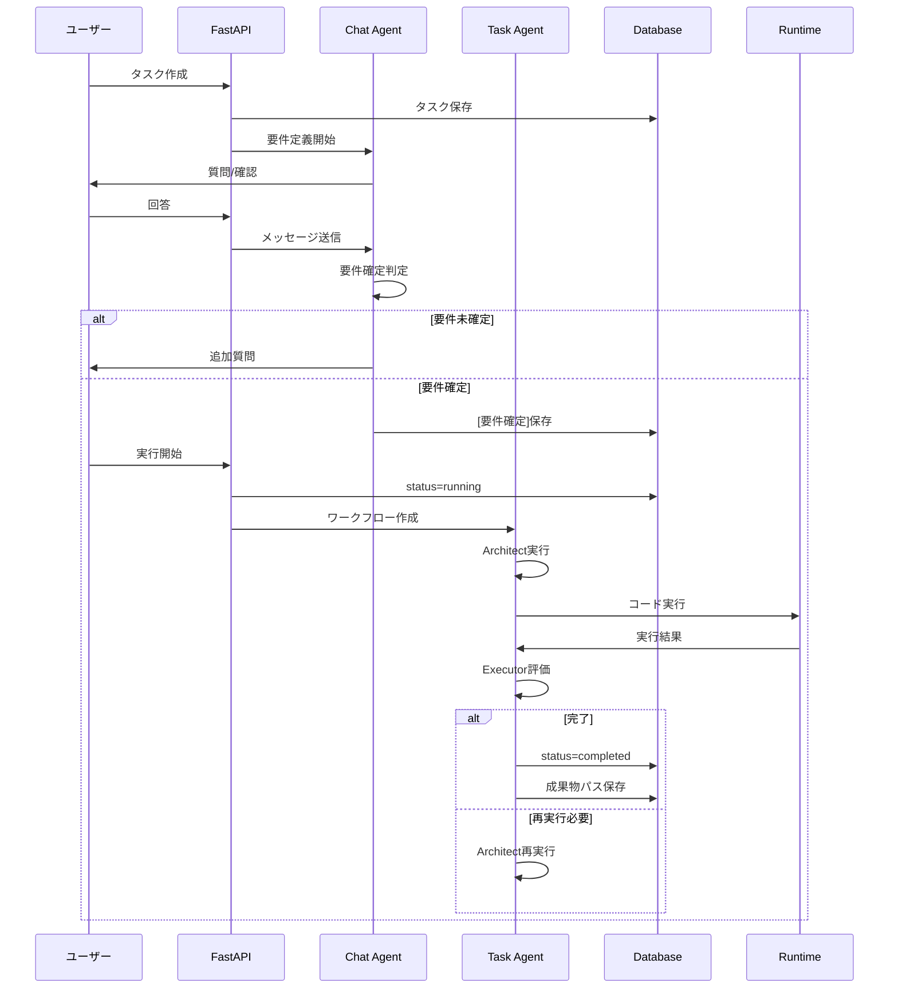
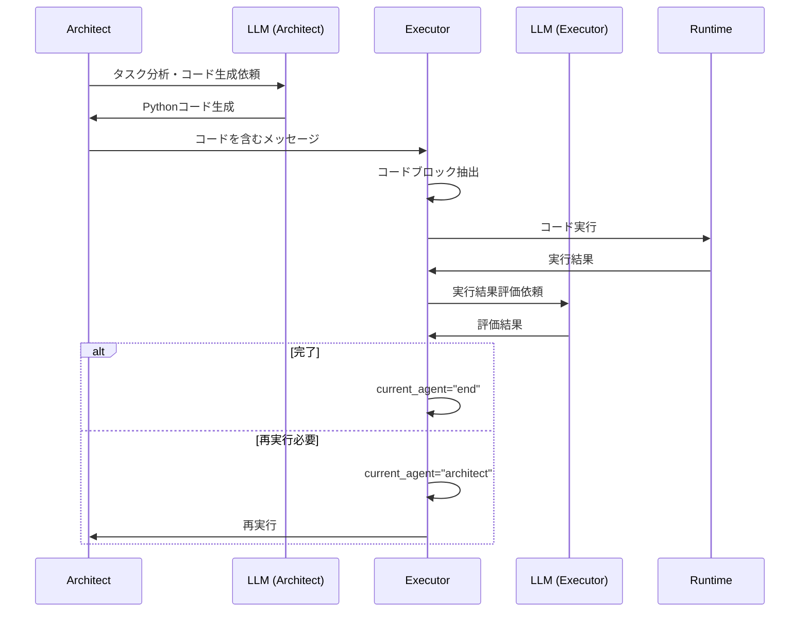

# Agent仕様書（現時点版）

> **⚠️ バージョン情報**: 本ドキュメントは**現在の実装状況（現時点版）**を反映しています。
> - 作成日: 2024年
> - 最終更新: 2024年
> - ステータス: **現時点版（Phase 4実装時点）**
> 
> ※ 仕様は今後の開発に伴い変更される可能性があります。

## 概要

CoTask Agentは、LangGraphベースのマルチエージェントシステムです。タスクの要件定義から実行までを自動化します。

**現時点での実装状況**:
- ✅ Phase 1-4: 基盤構築、要件定義チャット、マルチタスクUI、実行エージェント
- 🔄 Phase 5: 成果物ダウンロード（実装中）
- ⏳ Phase 6: Runtimeコンテナ分離（未実装）

## システムアーキテクチャ



## エージェントの種類

### 1. Chat Agent (要件定義エージェント)

**目的**: ユーザーとの対話を通じてタスクの要件を明確化する

**実装ファイル**: `backend/chat_agent.py`

**特徴**:
- LangGraphベースのシンプルなチャットフロー
- 推測を入れずに要件を定義
- 不明点があれば質問を返す
- 要件確定時に `[要件確定]` マーカーを含める

**状態管理**:
```python
class ChatState(TypedDict):
    messages: Annotated[list[BaseMessage], ...]
    requirements_defined: bool  # 要件が確定したかどうか
    requirements_summary: str   # 要件の要約
```

**フロー**:


**システムプロンプト**:
- 推測を入れずに要件を定義
- 不明点があれば具体的な質問をする
- 要件確定時は `[要件確定]` マーカーを含める

**使用LLM**:
- デフォルト: `gpt-4o-mini`
- Temperature: 0.7

### 2. Task Agent (実行エージェント)

**目的**: 確定した要件に基づいてコードを生成・実行し、タスクを完了させる

**実装ファイル**: `backend/agents.py`

**特徴**:
- LangGraphベースの2ノードワークフロー
- ArchitectとExecutorの協調作業
- 最大2イテレーションのループ構造
- 速度優先の設計（temperature=0.3）

**状態管理**:
```python
class AgentState(TypedDict):
    messages: Annotated[list, lambda x, y: x + y]
    task_id: str
    task_name: str
    task_description: str
    runtime_output_path: str
    current_agent: str  # "architect" | "executor" | "end"
    iteration_count: int
    max_iterations: int  # デフォルト: 2
```

**ワークフロー**:

以下の図は、LangGraphの `get_graph().draw_mermaid()` メソッドを使用して実際の実装コードから自動生成されたワークフローグラフです。



**ワークフローの説明**:
1. **開始** (`__start__`) → **Architect Node** (`architect`)
   - タスクの分析とコード生成を開始
2. **Architect Node** → **Executor Node** (`executor`)
   - 生成されたコードをExecutorに渡す
3. **Executor Node** → **条件分岐**
   - 完了判定により、以下のいずれかに分岐：
     - `__end__`: タスク完了（実線矢印）
     - `architect`: 再実行が必要（点線矢印）

> **注**: 上記のグラフは `backend/generate_graph_images.py` を実行することで自動生成されます。実装コードと常に同期されます。

#### 2.1 Architect Node

**役割**: タスクを分析し、Pythonコードを生成する

**動作**:
1. タスク名と説明を分析
2. シンプルで動作するPythonコードを生成
3. コードを ````python` ブロックで囲む
4. 出力先を `runtime_output_path` に指定

**システムプロンプトの要点**:
- 速度とシンプルさを優先
- 最小限の動作するコードを書く
- 不要な複雑さを避ける

**出力**: コードを含むAIMessage

#### 2.2 Executor Node

**役割**: コードを実行し、結果を評価する

**動作**:
1. Architectが生成したコードを抽出
2. コードを実行環境で実行
3. 実行結果を評価
4. 完了判定を行う

**完了判定条件**:
- レスポンスに完了キーワードが含まれる:
  - "complete", "finished", "done", "successfully", "completed", etc.
- コード実行が成功し、エラーがない
- 最大イテレーション数に到達

**システムプロンプトの要点**:
- コードが正常実行され、出力が作成されれば完了と判断
- 軽微なエラーでも出力があれば完了と判断
- 完全に失敗した場合のみ再実行を要求

**使用LLM**:
- OpenAI / Anthropic (設定可能)
- Temperature: 0.3 (速度優先)
- Max Tokens: 2000

## データモデル



### タスクステータス

- `pending`: 定義中（要件定義フェーズ）
- `running`: 実行中（Task Agent実行中）
- `completed`: 完了
- `failed`: 失敗
- `cancelled`: キャンセル

## 実行フロー

### 全体フロー



### Task Agent実行フロー（詳細）



## コード実行環境

### 現在の実装（Phase 4）

- **実行場所**: バックエンドコンテナ内（同一プロセス）
- **実行方法**: `subprocess.run()` を使用
- **タイムアウト**: 300秒
- **作業ディレクトリ**: `/app/data/artifacts/{task_id}/`

### 将来の実装（Phase 6）

- **実行場所**: 専用Runtimeコンテナ
- **実行方法**: Docker API経由でコンテナ内実行
- **分離**: メインコンテナを汚染しない

## APIエンドポイント

### Chat Agent関連

- `POST /api/chat` - チャットメッセージ送信
- `GET /api/chat/sessions/{session_id}` - チャット履歴取得
- `POST /api/chat/sessions` - 新規セッション作成

### Task Agent関連

- `POST /api/tasks` - タスク作成
- `GET /api/tasks` - タスク一覧取得
- `GET /api/tasks/{task_id}` - タスク詳細取得
- `POST /api/tasks/{task_id}/chat` - タスクチャット送信
- `GET /api/tasks/{task_id}/chat` - タスクチャット履歴取得
- `POST /api/tasks/{task_id}/execute` - タスク実行開始
- `GET /api/tasks/{task_id}/logs` - タスクログ取得
- `GET /api/tasks/{task_id}/artifacts` - 成果物一覧取得
- `GET /api/tasks/{task_id}/artifacts/{file_path}` - 成果物ダウンロード

## 設定

### 環境変数

- `OPENAI_API_KEY`: OpenAI APIキー
- `ANTHROPIC_API_KEY`: Anthropic APIキー
- `DATABASE_URL`: データベースURL（デフォルト: SQLite）

### LLM設定

**Chat Agent**:
- Model: `gpt-4o-mini`
- Temperature: 0.7

**Task Agent**:
- Model: 設定可能（OpenAI/Anthropic）
- Temperature: 0.3
- Max Tokens: 2000

### 実行パラメータ

- **最大イテレーション数**: 2（Task Agent）
- **コード実行タイムアウト**: 300秒
- **成果物保存先**: `/app/data/artifacts/{task_id}/`

## ログとモニタリング

### TaskLog

タスク実行中のログは `TaskLog` テーブルに保存されます：

- `role`: "architect", "executor", "system"
- `content`: ログ内容
- `timestamp`: ログ時刻

### ログファイル

- アプリケーションログ: `/app/data/app.log`
- ローテーション: 10MB
- 保持期間: 7日間

## エラーハンドリング

### Chat Agent

- APIキー未設定時: エラーメッセージを返す
- LLM呼び出し失敗時: エラーメッセージを返す

### Task Agent

- LLM作成失敗時: 例外を発生
- コード実行失敗時: Executorが評価し、必要に応じて再実行
- 最大イテレーション到達時: ワークフローを終了
- 実行エラー時: タスクステータスを `failed` に更新

## 成果物管理

### 保存場所

- パス: `/app/data/artifacts/{task_id}/`
- タスク完了時に `Task.artifact_path` に保存

### ファイル形式

- 任意の形式（テキスト、JSON、画像、CSVなど）
- Architectが生成したコードが決定

## LangGraphグラフの生成方法

### グラフ画像の自動生成

LangGraphには、ワークフローを自動的に可視化する機能が組み込まれています。以下のスクリプトを使用して、実際のワークフロー構造を画像として出力できます：

**使用方法**:

```bash
cd backend
python generate_graph_images.py
```

**生成されるファイル**:
- `docs/images/task_agent_workflow.mmd` - Mermaid形式のグラフ定義（✅ 生成済み）
- `docs/images/task_agent_workflow.png` - PNG画像（✅ 生成済み）
- `docs/images/task_agent_workflow.txt` - ASCII形式のテキスト図（✅ 生成済み）

> **📁 ファイル参照**: 生成されたファイルは [`docs/images/`](images/) ディレクトリに保存されています。

**コード例**:

```python
from langgraph.graph import StateGraph

# ワークフローを作成
app = create_workflow(...)

# グラフを取得
graph = app.get_graph()

# Mermaid形式で出力
mermaid_code = graph.draw_mermaid()
print(mermaid_code)

# PNG画像として出力（可能な場合）
try:
    png_data = graph.draw_mermaid_png()
    if png_data:
        with open("workflow.png", "wb") as f:
            f.write(png_data)
except Exception as e:
    print(f"PNG generation not available: {e}")

# ASCII形式で出力
ascii_diagram = graph.draw_ascii()
print(ascii_diagram)
```

**メリット**:
- 実装コードから自動的にグラフ構造を抽出
- コードと図が常に同期される
- 手動で図を更新する必要がない
- 実際のLangGraph構造を正確に反映

**生成されたグラフファイル**:
- 実際に生成されたグラフファイルは `docs/images/` ディレクトリに保存されています
- これらのファイルは実装コードから自動生成されるため、コード変更時は再実行してください

## 今後の拡張予定

1. **Phase 6**: Runtimeコンテナ分離
   - Docker-in-Dockerによる実行環境の分離
   - より安全なコード実行

2. **エージェント拡張**
   - 追加のエージェントノード（レビューア、テスターなど）
   - より複雑なワークフロー

3. **モデル選択**
   - UIからモデル選択機能の強化
   - モデルごとの最適化

---

**注意**: 本ドキュメントは現時点（Phase 4実装時点）の仕様を記載しています。今後の開発により、仕様が変更される可能性があります。
